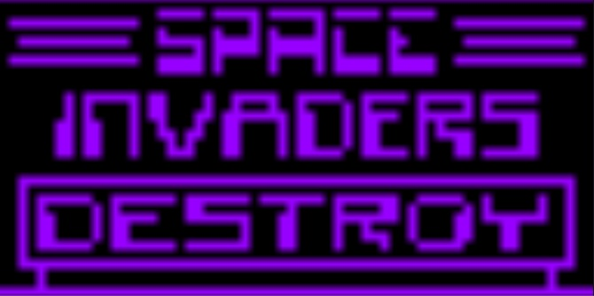
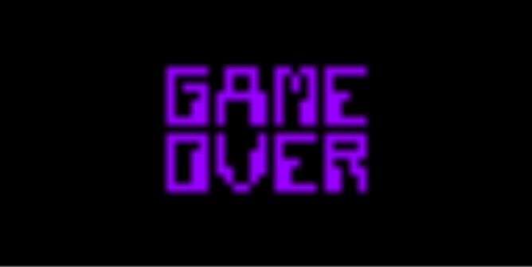

# Chip8
<H1>Chip8 emulator built in Unity3D</H1>

A no frills chip8 emulator built in Unity3D that works fairly well. 
If you can get it to run in webgl please let me know and I will update the source.
Uses a dictionaty instead of switch statement for opcode execution.

