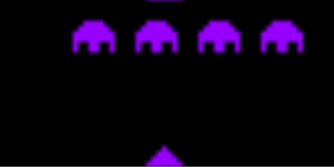

# Chip8
Chip8 emulator built in Unity3D

A no frills chip8 emulator that works fairly well. 
If you can get it to run in webgl please let me know and I will update the source.
Uses a dictionaty instead of switch statement for opcode execution.

